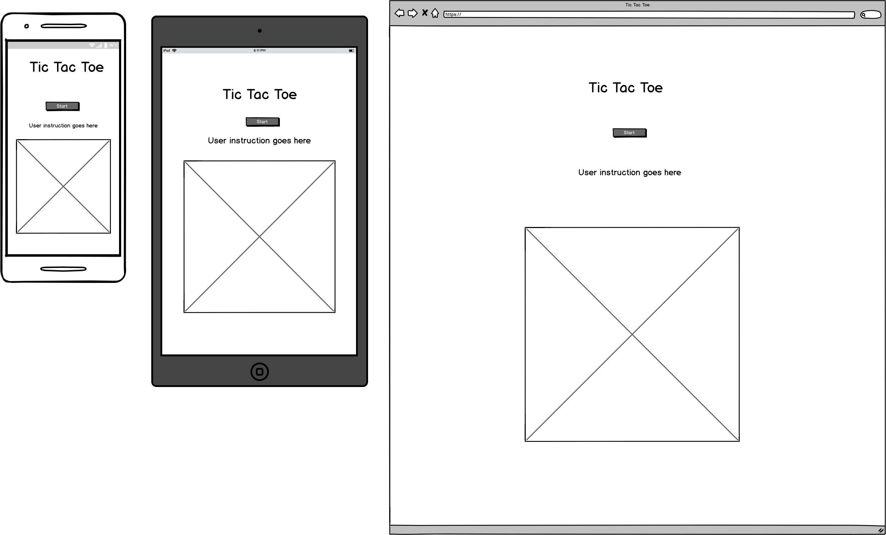
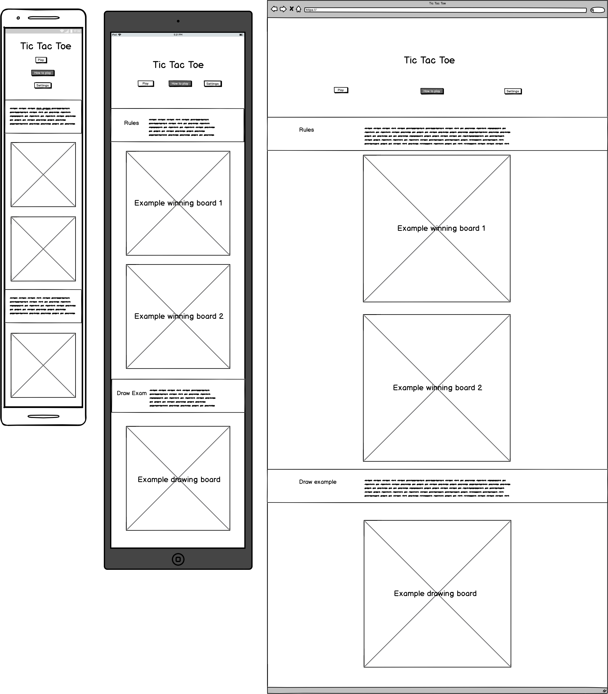
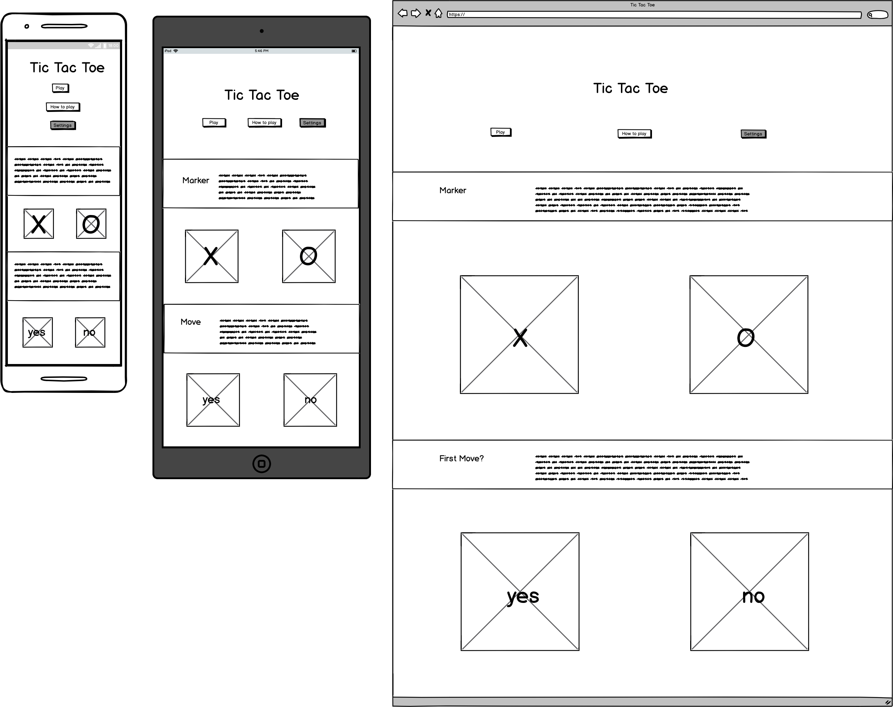

# Tic Tac Toe

## Description

A simple 1 player game of tic tac toe, commonly referred to as "Naughts and crosses". This game is a great way to introduce young children to the basics of game theory which can extend into other more complex games such as connect 4 or ultimately chess. The difficulty of the computer setting isn't very high. But to a child who isn't familiar with the game it should provide a challenge initially. This project is written in HTML/CSS/JS.

## Goals of the Game 

<ul>
<li>Target audience would be children under 13 years old.</li>
<li>To be used mainly as entertainment but can also carry some educational benefits alongside it.</li>
<li>Be presented in an easy to use manner whilst drawing the user in.</li>
</ul>

## User Interface Design

The emphasis is placed on simple and easy to use in this project. Whilst instructions & rules will be given in the tutorial along with small prompts during gameplay, the idea is that the design is so simple that these instructions aren't really necessary. Vivid colours and fonts following a retro theme are used to draw children into the game. 

### Essential Features

<ul>
    <li>
    Have functioning Tic Tac Toe game  in single player mode. 
    </li>
    <li>
    Appropriate testing carried out to ensure no bugs in game play. (Game resets after 
    completing, Alternates players correctly etc.)
    </li>
    <li>
    Has instructions/ tutorial page with clear and simple steps to follow.
    </li>
    <li>
    Play again or quit? Option via modal.
    </li>
</ul>

### Bonus Features

<ul>
    <li>    
    Chose Os or Xs.
    </li>
    <li>
    Chose whether you or computer goes first.
    </li>
    <li>
    Display statistics of game history. e.g. Moves made, Games won out of last 5 etc.
    </li>
</ul>

### Features that won't be implemented

<ul>
    <li>
    User can Change Themes and display settings.
    </li>
    <li>
    Two player option.
    </li>
    <li>
    Different levels of difficulty.
    </li>
</ul>

## Wireframes

### Game page

### Tutorial page:

### Options page:

## STRATEGY

It's an imperfect strategy played by the computer. Whereby initially picking
its next move based upon available spaces that occur on the greatest number of 
winning lines. Depicted by the array below:

3 2 3 
2 4 2 
3 2 3 

However this strategy alone isn't sufficient for a challenging game of tic tac 
toe. Due to the fact that none of the decision making is related to what the 
other player is doing. So the strategy that takes priority is to complete a line.
This has been defined by scanning across all rows and columns and searching for 
lines that occupy 2 of the _same_ marker with a space to be filled.Then by 
filling this space irrespective of the markers on the line it will serve as an
offensive or a defensive move to win OR to stop the other player winning.

This strategy can be beaten because it starts in the middle space whilst 
although having most winning line opportunities it also takes more attempts to 
complete those lines when compared with starting in the corners. When spaces of
equal line opportunity havent been marked the computer simply picks the first 
one available in the iteration from top left corner through each row to the bottom
right corner. This decision process isn't optimised.

The optimal game strategy would consist of fewest attempts to create maximal line
opportunities.

Allowing the user to win some of the time, encourages them to play the game. The user
also has the upper hand by choosing first.

## Testing

As part of the functionality phase each of the two html pages shall be tested separately. The "game.html" contains all of the gameplay. The only information that is transferred from the index page to the game page are two variables indicating the user's preference with regards to gameplay options. They can chose whether or not they make the first move via 'yes' or 'no'. Also which marker is selected, 'X' or 'O'. If nothing is selected then the default options are 'X' and 'yes'. Altogether there are 4 possible combinations (2x2) of player options to be selected. There are 9 ways (3x3) of selecting these options, factoring in the default setting for each option. 

### Gameplay

<ol>
<li>
Options set or none set for default setting. Press "play" button on main menu, browser should navigate directly to "game.html" page.
</li>
<li>
Prior to pressing the start button, scan the cursor over every board square and try to click each square. No hover effect or result should be seen of any kind.
</li>
<li>
Upon pressing the start button, the button text should change to "reset".
</li>
<li>
No mark is made initially on the board. However upon moving the cursor over every board space, the hover effect of the user mark (that has been selected) rotating in and out of view should be seen.
</li>
<li>
After clicking on a space, the hover effect dissappears and the user's mark is cemented on to the board.
</li>
<li>
Immediately afterwards the computer's mark should be made on a different space. That space also losing its hover effect.
</li>
<li>
Repeat steps 5-6 until either no spaces remain or until a winner is found.
</li>
<li>
In the event a winner is found:
<ul>
<li>
If the line contains 3 of the user's mark in a row/ column/ diagonal. Message outputted to modal is 
"Congratulations, you win."
</li>
<li>
If the line contains 3 of the computer's mark in a row/ column/ diagonal. Message outputted to modal is 
"Sorry, you lose."
</li>
<li>
If there is no line of 3. Message outputted to modal is "It's a draw."
</li>
</ul>
</li>
<li>
There are two modal buttons, "quit" & "play again"
<ul>
<li>
After clicking "quit", the app returns to the main menu page.
</li>
<li>
After clicking "play again", the modal is closed and the board is reset with the same conditions as steps 3 & 4.
</li>
</ul>
<li>
Repeat the test. Only this time, during steps 5-6 click the "reset" button. The board should be in the same state 
as before in step 2 & the button text should have changed back to "start".
</li>
</ol>

This test is to be repeated for all 4 possible option settings, and carried out a total of 9 times (for default settings).

All Game flow tests passed.

### Main Menu Flow 

There are 3 buttons on the main page; "play", "tutorial" & "options". The initial state of the page upon entering should be 
only the title and buttons displayed, no content. The following test should be carried out to ensure all buttons serve as toggles correctly.

#### Single Toggle effect

<ol>
<li>
Move cursor over each of 3 buttons, no hover effect to be seen.
</li>
<li>
After clicking the "tutorial" button, the button colours invert & the tutorial content appears.
</li>
<li>
Click the same button again and the button colours return back to normal and the content dissappears.
</li>
<li>
Repeat steps 2 & 3 for "options" button.
</li>
</ol>

#### Cross Toggle effect

<ol>
<li>
Click the "Tutorial" button, button colours invert & the content appears.
</li>
<li>
Now click the "Options" button, this button's colours invert whilst the Tutorial button's colours return to normal. Options content replaces the tutorial content.
</li>
<li>
Click the "options" button again and all of the button colours are now back to normal and all of the content has dissappeared.
</li>
<li>
Repeat steps 1-3 starting with the "options" button and crossing over to the "tutorial" button.
</li>
</ol>

#### 4 Option selectors

<ol>
<li>
Hover over all 4 selectors ('X','O','yes' & 'no') and witness the hover effect of each selector's background turning to a cream colour and text changing to black.
</li>
<li>
Upon clicking on each of the selectors the hover ceases and the hover styling is cemented onto that particular element. 
</li>
<li>
Until another selector is clicked on from the same row in which case the styling of the previously selected element returns to black background and orange text. Whilst the newly selected element takes on the hover styling. Other row remains unaffected by this as the two rows' toggle effects are independent of each other.
</li>
<li>
Repeat steps 2 & 3 for the other row.
</li>
</ol>

All Main menu tests passed.

### W3C Validation

To complete the functionality testing, I ran my code through the W3C validation service for both HTML and CSS (linked below).

HTML: https://validator.w3.org/#validate_by_input CSS : https://jigsaw.w3.org/css-validator/#validate_by_input

After validating the "index.html" for the first time, two warnings were flagged regarding the "options" section not having a heading & also the script link for "menu.js" containing an unneccesary type attribute. 

Following these results, I added a heading above both the marker and the move option paragraphs and eliminated the type attribute. Upon retesting there were no warnings or errors flagged.

After validating the "game.html" for the first time, two similar warnings were flagged regarding the "board-area" section not having a heading & also the script link for "gameFlow.js" containing an unneccesary type attribute. 

Following these results, I simply turned the section element tags in question into div tags because a title would be unnecessary here and then I eliminated the type attribute. Upon retesting there were no warnings or errors flagged.

CSS passed first time with no errors or warnings.

### Strict Mode 

To test my javascript files, I added the "use strict" statement at the top of both the "menu.js" and "gameFlow.js" files and ran my project in the browser. Opening the console whilst i carried out the gameplay and menu flow tests mentioned above and proceeding to note down any errors or significant warnings that occured during these tests. 

The "menu.js" didn't flag any errors. Initially the "gameFlow.js" did raise an Uncaught exception error. At this point the console stated that it didn't recognise variables such as 'i', 'j' or 'id'. Further examination revealed that i hadn't initialized these variables correctly in their respective 'for' loops omitting the scope of the variable (var/let). I amended this to cease these errors.

Eventually the test passed and the "use strict" statements were removed from the files.

### Compatibility

The project was ran in three different browsers: chrome, safari & firefox. 

In each browser I performed the following assessments:
<ul>
<li>Gameplay tests noting any differences in performance</li>
<li>Menu flow tests noting any differences in functionality</li>
<li>Fonts and colour consistency- using the respective dev tools/inspector I selected each element and noted the hexadecimal color code and font type ensuring the font family, size & weight had carried over successfully from what was written in code.</li>
<li>Spacing, margins & alignment were consistent across all formats. Checking in a similar manner using dev tools as written above.</li>
</ul>

All tests passed.

### User test

I asked my nephew to take a look at the game application and play at least 10 games changing the options in order to experience all combinations of markers and moving first or second. I gave him the instructions that he has to try his best to win. The purpose being to understand how difficult i had made the game - ideally he should not win first time but after playing through more & more iterations win more or at the very least lose less. Also to give back any feedback with regards to how easy the game is and how enjoyable it was.

He only lost once, drew 7 times and won 2 times. He remarked "It's a lot more difficult to win, if the computer makes the first move", which is true. Noting the look of the game he said he enjoyed the bright colour theme.

## Code to Website

This project can easily be deployed on your local system by following these simple steps...
<ol>
<li>Open your terminal and create a folder (command: 'mkdir [folder_name]') in the location
where you want to bring the Github repository.</li>
<li>Copy this url: https://github.com/Domchap90/tictactoe.git</li>
<li>Go back to your terminal and move INSIDE your new folder (command:'cd [folder_name]').</li>
<li>Type 'git clone ' then paste in the url and press Enter.</li>
<li>The git repository is now in your local file system and ready to be deployed on your IDE.</li>
</ol>
If you don't already have an IDE set up. I would recommend using an online alternative like gitpod instead. gitpod.io/docs/getting-started/

Or simply visit my GitHub Pages on https://domchap90.github.io/tictactoe/.

## Technologies

The range of different technologies used in this game application is very narrow, because its heavily showing off my javascript coding logic. 
<ul>
<li>
HTML provides the basic content.
</li>
<li>
CSS provides the styling rules.
</li>
<li>
Bootstrap4 is used only in the "index.html" page to create the fluid container effect.
</li>
<li>
Jquery is added to take advantage of the simplified interactions with the DOM.
</li>
<li>
GoogleFonts is linked in to allow the use of "Niramit" & "Tomorrow" fonts.
</li>
<li>
Balsamiq was used to draw the wireframes.
</li>
</ul>

## References

To create the rotating boardspace effect, the following link was used :
https://www.w3schools.com/howto/howto_css_flip_card.asp

## Acknowledgements

I would like to thank my nephew Daniel for helping me test the game. Also to my mentor Brian for his
continued support and dropping his major pearls of wisdom. 